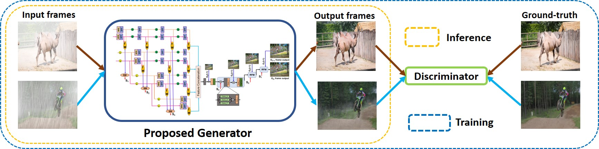

# Dual-frame Spatio-temporal Feature Modulation for Video Enhancement (PR-2022)
Prashant W Patil, Sunil Gupta, Santu Rana, and Svetha Venkatesh


[](https://drive.google.com/file/d/1V1pmVIA29_gSoiOdfFBzmqBHt-3bcsGQ/view?usp=sharing)


<hr />

> **Abstract:** *Current video enhancement approaches have achieved good performance in specific rainy, hazy, foggy, and snowy weather conditions. However, they currently suffer from two important limitations. First, they can only handle degradation caused by single weather. Second, they use large, complex models with 10–50 millions of parameters needing high computing resources. As video enhancement is a pre- processing step for applications like video surveillance, traffic monitoring, autonomous driving, etc., it is necessary to have a lightweight enhancement module. Therefore, we propose a dual-frame spatio- temporal feature modulation architecture to handle the degradation caused by diverse weather condi- tions. The proposed architecture combines the concept of spatio-temporal multi-resolution feature mod- ulation with a multi-receptive parallel encoders and domain-based feature filtering modules to learn domain-specific features. Further, the architecture provides temporal consistency with recurrent feature merging, achieved by providing feedback of the previous frame output. The indoor (REVIDE, NYUDepth), synthetically generated outdoor weather degraded video de-hazing, and de-raining with veiling effect databases are used for experimentation. Also, the performance of the proposed method is analyzed for night-time de-hazing and de-raining with veiling effect weather conditions. Experimental results show the superior performance of our framework compared to existing state-of-the-art methods used for video de-hazing (indoor/outdoor) and de-raining with veiling effect weather conditions..* 
<hr />

## Network Overview

 

## Requirements:

	Python >= 3.5

	Tensorflow == 2.0

	Numpy

	PIL

## Testing Videos:
	Keep Testing Videos Frames in "videos/{dataset}" folder.

## Checkpoints:
	The checkpoints are provided for:
	1. Scratch trained checkpoints for REVIDE and RainSynAll100 datasets.
	2. Keep the checkpoints in "./checkpoints/dataset/"
Download the checkpoint: [](https://drive.google.com/file/d/144BGWIvF2d-dZA6_8y9rBgbbO9CvxULH/view?usp=sharing)

## Testing Procedure:
	1. select options  --dataset, --test_dir, --checkpoint_path in "options.py"  
	2. Run "testing.py"
	3. Results will be saved in --output_path

## Database:


Synthetically Generated Day and Night-time Weather Degraded Database is available at: [](https://drive.google.com/drive/folders/1bmtJc2098liM0iOVM3Nb3S6xugvoKy_f?usp=sharing)

```

## Citation
If our method is useful for your research, please consider citing:
    
     @article{patil2022dual,
 	title={Dual-frame Spatio-temporal Feature Modulation for Video Enhancement},
  	author={Patil, Prashant W and Gupta, Sunil and Rana, Santu and Venkatesh, Svetha},
  	journal={Pattern Recognition},
  	pages={108822},
  	year={2022},
  	publisher={Elsevier}
        }


## Contact
Please contact prashant.patil@deakin.edu.au, if you are facing any issue.


